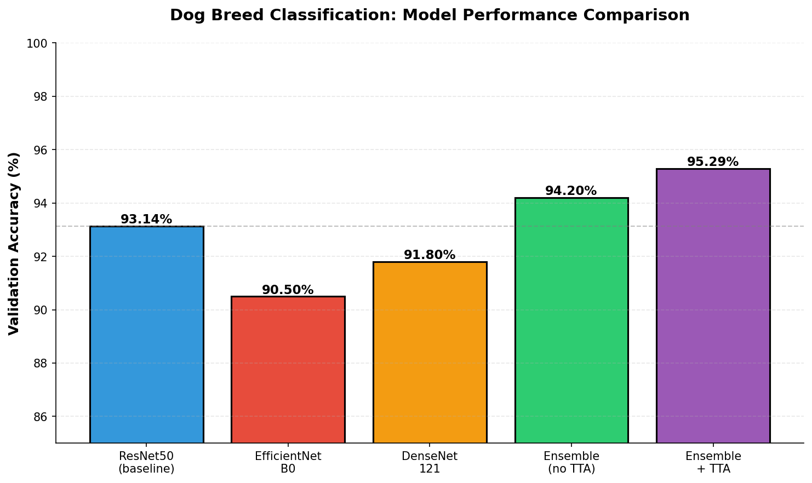

# Dog Breed Classification

CNN-based classifier achieving 95% accuracy across 70 dog breeds using ensemble transfer learning.

[](https://www.python.org/downloads/)
[](LICENSE)
[](https://github.com/uehlingeric/dog-breed-classification/releases/tag/v1.0.0)



## Overview

Multimodel ensemble system for dog breed classification trained on 7,946 images across 70 breeds. Transfer learning with ResNet50, EfficientNet B0, and DenseNet121 reaches 93.14% accuracy; ensemble with test-time augmentation (TTA) achieves 95.29%. The system addresses class imbalance (ratio 3.05) through weighted loss and handles visually similar breeds with improved accuracy through voting.

## Key Results

| Model | Accuracy | Inference Speed |
|-------|----------|-----------------|
| ResNet50 (baseline) | 93.14% | 217.53 FPS |
| Ensemble (no TTA) | 94.2% | 45.25 FPS |
| Ensemble + TTA | 95.29% | 9.05 FPS |

Ensemble with TTA improves difficult classes: Scotch Terrier (+40%), Shih-Tzu (+20%), American Hairless (+20%).

## How It Works

### Transfer Learning
Freezes convolutional base layers from ImageNet-pretrained models and replaces classification heads with custom 70-unit layers. Fine-tuning selectively unfreezes later layers during training to adapt high-level features to dog breeds.

### Ensemble Method
Combines three architectures with complementary strengths: ResNet's depth, EfficientNet's parameter efficiency, and DenseNet's feature reuse. Per-class weights are computed from validation performance, balancing model confidence with accuracy.

### Test-Time Augmentation
Generates five image variants per sample (original, horizontal flips, rotations, brightness adjustments) and averages predictions. Dramatically improves performance on challenging, visually variable breeds.

## Quickstart

```bash
git clone https://github.com/uehlingeric/dog-breed-classification.git
cd dog-breed-classification
uv sync
uv run jupyter notebook notebooks/01-training.ipynb
```

Requires Python 3.11+; training on GPU recommended (tested on RTX 4070, ~8.5 min for ResNet50 baseline).

## Usage

Train a single model:

```python
from dog_breed_classifier import set_seed, get_device
set_seed(42)
device = get_device()
# See notebooks/01-training.ipynb for full pipeline
```

Training data setup: see `data/README.md`.

## Project Structure

```
.
├── notebooks/01-training.ipynb  # End-to-end pipeline and analysis
├── src/dog_breed_classifier/    # Utilities: data loading, preprocessing
├── data/README.md               # Dataset acquisition instructions
├── docs/assets/                 # Result visualizations
├── Makefile                     # Commands: setup, test, lint, run
├── pyproject.toml               # uv-managed dependencies
└── LICENSE                      # MIT license
```

## Data

Training dataset: 7,946 labeled dog images (train 7,946, validation 700, test 200). Dataset is not committed; see `data/README.md` for acquisition details.

## Limitations

- Inference with TTA is slow (9 FPS) due to 5x forward passes; unsuitable for real-time applications
- Visually similar breeds remain challenging (e.g., Boston Terrier vs. Bulldog confusion)
- Model trained on RTX 4070; CPU inference speed not measured
- No incremental learning; retraining required for new breed classes

## License

MIT © Eric Uehling.
